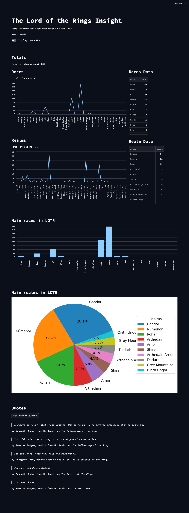

# Next Level Py Challenge: LOTR Insight

Challenge for the **Next Level Python** Course.

This project uses the wonderful [The One API to rule them all](https://the-one-api.dev/), to obtain data from the
characters, quotes an movies of **The Lord of the Rings**, and get insight from it.

The idea of this project is to put into practice the tools learned in the course:

- Type annotations
- Data clasess
- Functools
- Itertools
- Generators
- Asynchronous programming
- Context Managers

## Installation

Clone this repository:

```shell
git clone https://github.com/hharrisd/nextlevel-py-challenge.git
```

Go to the repository directory and install the requirements:

```shell
cd nextlevel-py-challenge
pip install -r requirements.txt
```

## Usage

This projects executes asynchronous requests to create CSV files. Then those files are read with pandas to create
datafreams, and with them, plot some charts and get some random quotes.

In order to use the LOTR API, is necesary to configure a token. Sign-up to obtain the token, and configure it in an
environment variable called ```API_TOKEN```. A helpful library for this in Python
is [environs](https://pypi.org/project/environs/).

Once the API_TOKEN is configure, you could run the app by executing this line:

```shell
streamlit run home.py
```

Delete the .csv files from the data directory so that the application can make asynchronous requests and create the
files.

